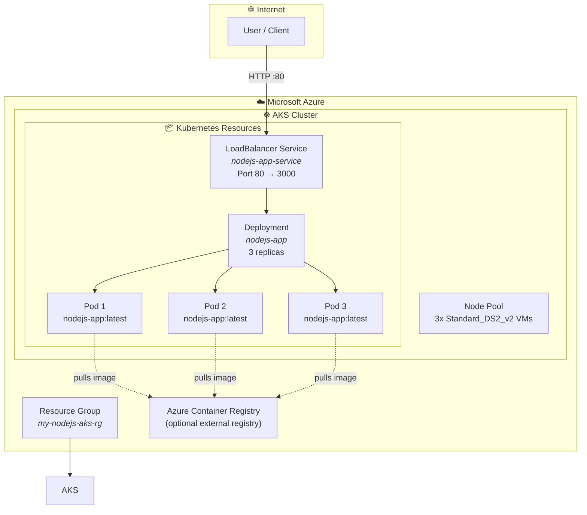
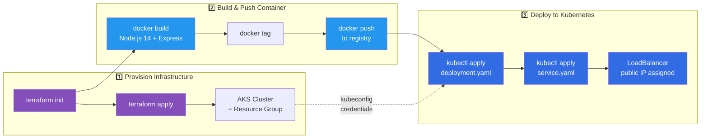
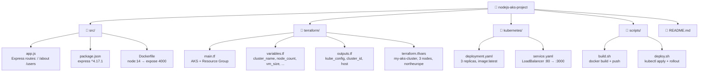

# Node.js on Azure Kubernetes Service (AKS) — Infrastructure as Code

[](https://www.terraform.io/)
[](https://azure.microsoft.com/)
[](https://kubernetes.io/)
[](https://nodejs.org/)
[](https://www.docker.com/)

A fully automated **Infrastructure as Code** (IaC) project that provisions an **Azure Kubernetes Service (AKS)** cluster using **Terraform**, containerizes a **Node.js / Express** web application with **Docker**, and deploys it onto the cluster via **Kubernetes manifests**.

> **For recruiters:** This end-to-end project demonstrates cloud provisioning (Azure), infrastructure automation (Terraform), containerization (Docker), container orchestration (Kubernetes), and application development (Node.js) — all in one reproducible pipeline.
>
> **For engineers:** A clean reference architecture for deploying containerized workloads on Azure with repeatable Terraform-managed infrastructure and standard Kubernetes manifests.

---

## Architecture Overview

### High-Level Infrastructure



### Deployment Pipeline



### Project Structure



---

## Technology Stack

| Layer | Technology | Purpose |
|---|---|---|
| **Cloud Provider** | Microsoft Azure | Infrastructure hosting |
| **IaC** | Terraform (HCL) | Provision AKS cluster & resource group |
| **Container Runtime** | Docker | Package Node.js app into image |
| **Orchestration** | Kubernetes | Manage containers (Deployment & Service) |
| **Application** | Node.js 14 / Express.js | Simple REST API server |
| **Automation** | Bash | Build & deploy scripts |

---

## Prerequisites

| Tool | Version | Purpose |
|---|---|---|
| [Azure CLI](https://docs.microsoft.com/cli/azure/install-azure-cli) | Latest | Authenticate with Azure |
| [Terraform](https://www.terraform.io/downloads) | >= 1.0 | Provision cloud resources |
| [Docker](https://docs.docker.com/get-docker/) | Latest | Build container images |
| [kubectl](https://kubernetes.io/docs/tasks/tools/) | >= 1.21 | Manage Kubernetes cluster |

You also need an **active Azure subscription** with sufficient quotas for AKS (3 x Standard_DS2_v2 VMs by default).

---

## Quick Start

```bash
# 1. Clone the repository
git clone <repo-url>
cd nodejs-aks-project

# 2. Authenticate with Azure
az login

# 3. Provision AKS infrastructure
cd terraform
terraform init
terraform apply   # ⚠️ Review changes before confirming
cd ..

# 4. Configure kubectl to connect to the new cluster
az aks get-credentials --resource-group my-nodejs-aks-rg --name my-aks-cluster

# 5. Build and push the Docker image
#    🔧 First update IMAGE_NAME in scripts/build.sh to your registry
./scripts/build.sh

# 6. Deploy the application to AKS
#    🔧 First update variables in scripts/deploy.sh
./scripts/deploy.sh

# 7. Get the public IP
kubectl get service nodejs-app-service
```

---

## Detailed Walkthrough

### 1. Infrastructure Provisioning (`terraform/`)

The Terraform configuration provisions:

- **Resource Group** — Logical container for all Azure resources
- **AKS Cluster** — Managed Kubernetes with:
  - 3 worker nodes (Standard_DS2_v2)
  - Azure CNI networking with Calico network policies
  - System-assigned managed identity
  - Configurable Kubernetes version, node count, and VM size

Key outputs (marked `sensitive` for security):
- `kube_config` — Cluster access credentials
- `host` — API server endpoint
- `client_certificate` — Authentication certificate

### 2. Application (`src/`)

A minimal Express.js server on **port 4000** with three endpoints:

| Route | Response |
|---|---|
| `GET /` | `"Hello from Node.js on AKS!"` |
| `GET /about` | `"This is a simple Node.js app running on AKS."` |
| `GET /users` | `"User list would be displayed here."` |

The **Dockerfile** uses `node:14` base image, installs npm dependencies, and exposes port 4000.

### 3. Kubernetes Deployment (`kubernetes/`)

| Resource | Type | Details |
|---|---|---|
| **Deployment** | `apps/v1` | 3 replicas, rolling update, image `${ACR_NAME}.azurecr.io/nodejs-app:latest` |
| **Service** | `v1` | Type `LoadBalancer`, maps port 80 → container port 3000 |

### 4. Automation Scripts (`scripts/`)

- **`build.sh`** — Builds the Docker image, tags it with the short git commit hash and `latest`, then pushes to your container registry
- **`deploy.sh`** — Creates a namespace (if needed), applies Deployment and Service manifests via `kubectl apply`, then waits for the rollout to complete

---

## Customization

### Variables (`terraform/terraform.tfvars`)

```hcl
resource_group_name = "my-nodejs-aks-rg"
location            = "northeurope"
cluster_name        = "my-aks-cluster"
node_count          = 3
vm_size             = "Standard_DS2_v2"
```

Adjust these to match your requirements (e.g., `node_count = 5` for higher availability).

### Port Configuration

The application listens on **port 4000** (`src/app.js`). If you change this, update:
1. `kubernetes/deployment.yaml` → `containerPort`
2. `kubernetes/service.yaml` → `targetPort`

---

## Clean Up

```bash
cd terraform
terraform destroy
```

This removes **all** Azure resources (resource group, AKS cluster, networking) to avoid ongoing costs.

---

## What This Project Demonstrates

- **Infrastructure as Code** — Entire Azure environment defined declaratively in Terraform
- **Containerization** — Node.js application packaged into a reproducible Docker image
- **Kubernetes Orchestration** — Deployment management (replicas, rolling updates) and service exposure via LoadBalancer
- **CI/CD Ready** — Scripted build and deploy pipeline, easily integrable with GitHub Actions, Azure DevOps, or Jenkins
- **Cloud-Native Patterns** — Managed Kubernetes, system-assigned identity, Azure CNI networking

---

## License

[MIT](../LICENSE)
