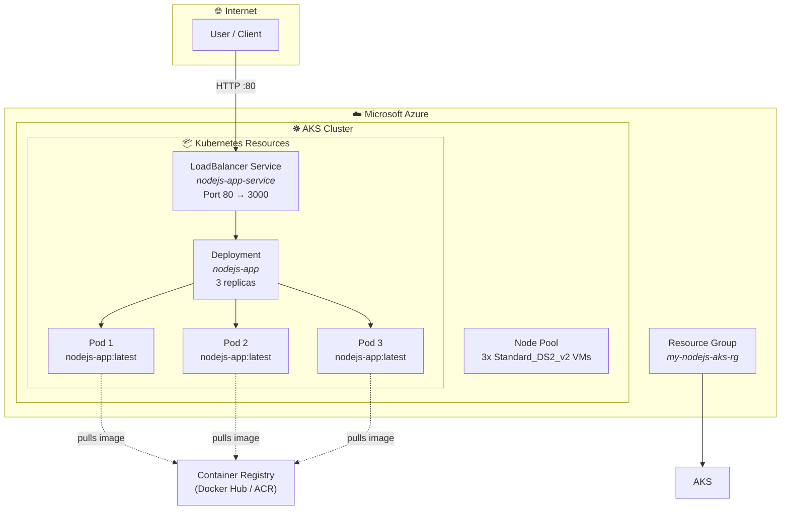
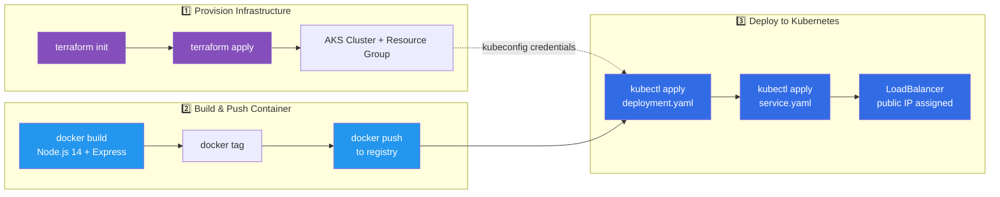
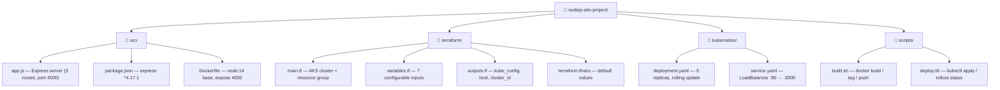

# Node.js on Azure Kubernetes Service (AKS) — Infrastructure as Code

[](https://www.terraform.io/)
[](https://azure.microsoft.com/)
[](https://kubernetes.io/)
[](https://nodejs.org/)
[](https://www.docker.com/)

An end-to-end **Infrastructure as Code** project that provisions an **Azure Kubernetes Service (AKS)** cluster via **Terraform**, containerizes a **Node.js (Express)** web server with **Docker**, and deploys it using **Kubernetes** manifests — all automated through shell scripts.

---

## 📋 Table of Contents

- [For Recruiters](#-for-recruiters)
- [For Engineers](#-for-engineers)
- [Architecture](#-architecture)
- [Quick Start](#-quick-start)
- [Detailed Walkthrough](#-detailed-walkthrough)
- [Customization](#-customization)
- [Clean Up](#-clean-up)

---

## 🔍 For Recruiters

> **Why this project matters:** It demonstrates every layer of a modern cloud-native deployment pipeline — from infrastructure provisioning to running application code — using the tools and practices that power real-world DevOps workflows.

### Skills Demonstrated

| Skill | How It's Applied |
|---|---|
| **Infrastructure as Code (IaC)** | Entire Azure environment defined in Terraform — repeatable, version-controlled, and destroyable |
| **Cloud Engineering (Azure)** | Provisioned AKS cluster, resource groups, networking (Azure CNI + Calico) |
| **Containerization** | Dockerized a Node.js app with a multi-stage build |
| **Container Orchestration** | Kubernetes Deployment (3 replicas) + LoadBalancer Service exposed to the internet |
| **DevOps / Automation** | Shell scripts automate the full build, push, and deploy cycle — CI/CD-ready |
| **Backend Development** | Express.js REST API with multiple routes |
| **Security Best Practices** | Sensible defaults: managed identity, sensitive output masking, Calico network policies |

### Technology Stack at a Glance

```
Cloud      →  Microsoft Azure (AKS)
Provision  →  Terraform (HCL)
Container  →  Docker
Orchestrate → Kubernetes
Code       →  Node.js / Express.js (port 4000)
Automate   →  Bash scripts
```

This project proves hands-on capability across the full **DevOps → Cloud → Backend** stack — exactly what cloud-native and platform engineering teams look for.

---

## 🛠️ For Engineers

A clean, minimal reference architecture for deploying containerized workloads on Azure. Everything is declarative, scripted, and ready to run.

### Design Decisions

| Choice | Rationale |
|---|---|
| **Terraform over ARM/Bicep** | Cloud-agnostic IaC; portable to AWS/GCP |
| **AKS with Azure CNI** | Native Azure networking; Calico for network policies |
| **System-assigned identity** | No manual secret management for cluster auth |
| **3 replicas** | Balance between availability and cost |
| **Standard_DS2_v2 nodes** | General-purpose burstable VMs — cost-effective for dev/test |
| **Shell scripts over CI config** | Keeps pipeline agnostic — drop into GitHub Actions, GitLab CI, or Azure DevOps |

### Prerequisites

| Tool | Min Version | Why |
|---|---|---|
| [Azure CLI](https://docs.microsoft.com/cli/azure/install-azure-cli) | Latest | `az login` + `az aks get-credentials` |
| [Terraform](https://www.terraform.io/downloads) | >= 1.0 | `terraform init` / `apply` / `destroy` |
| [Docker](https://docs.docker.com/get-docker/) | Latest | `docker build` / `push` |
| [kubectl](https://kubernetes.io/docs/tasks/tools/) | >= 1.21 | `kubectl apply` / `get service` |

Plus an **active Azure subscription** with quota for 3 x Standard_DS2_v2 VMs (12 vCPUs, 21 GiB RAM total).

---

## 📐 Architecture

### High-Level Infrastructure



### Deployment Pipeline



### Project Structure



---

## 🚀 Quick Start

```bash
# 1. Authenticate with Azure
az login

# 2. Provision the AKS infrastructure
cd terraform
terraform init
terraform apply    # Review plan before confirming
cd ..

# 3. Connect kubectl to the new cluster
az aks get-credentials --resource-group my-nodejs-aks-rg --name my-aks-cluster

# 4. Build & push the Docker image
#    ⚠️ Edit IMAGE_NAME in scripts/build.sh to point to your registry first
./scripts/build.sh

# 5. Deploy to AKS
#    ⚠️ Edit variables in scripts/deploy.sh first
./scripts/deploy.sh

# 6. Get the public LoadBalancer IP
kubectl get service nodejs-app-service
```

---

## 🔧 Detailed Walkthrough

### 1. Terraform (`terraform/`)

Provisions two Azure resources:

- **`azurerm_resource_group`** — Logical container (`my-nodejs-aks-rg` in `northeurope`)
- **`azurerm_kubernetes_cluster`** — Managed Kubernetes with:
  - Default node pool: 3x `Standard_DS2_v2`
  - Azure CNI + Calico network policies
  - System-assigned managed identity
  - Configurable tags for environment tracking

**Sensitive outputs** (not shown in logs): `kube_config`, `host`, `client_certificate`.

### 2. Application (`src/`)

A minimal Express.js server listening on **port 4000**:

| Endpoint | Response |
|---|---|
| `GET /` | `"Hello from Node.js on AKS!"` |
| `GET /about` | `"This is a simple Node.js app running on AKS."` |
| `GET /users` | `"User list would be displayed here."` |

The **Dockerfile** uses `node:14`, installs dependencies via `npm install`, and exposes port 4000.

### 3. Kubernetes (`kubernetes/`)

| Manifest | Type | Key Details |
|---|---|---|
| `deployment.yaml` | `apps/v1` | 3 replicas; image `${ACR_NAME}.azurecr.io/nodejs-app:latest` |
| `service.yaml` | `v1` | Type `LoadBalancer`; port 80 → `targetPort: 3000` |

### 4. Scripts (`scripts/`)

- **`build.sh`** — Builds the image, tags it with the short git commit hash and `latest`, pushes to your registry
- **`deploy.sh`** — Creates a namespace (optional), applies Deployment + Service manifests inline, waits for rollout

---

## ⚙️ Customization

### Terraform Variables (`terraform/terraform.tfvars`)

```hcl
resource_group_name = "my-nodejs-aks-rg"
location            = "northeurope"
cluster_name        = "my-aks-cluster"
node_count          = 3
vm_size             = "Standard_DS2_v2"
```

All 7 variables are defined in `variables.tf` with defaults and descriptions.

### Changing the Application Port

The app listens on **port 4000** (`src/app.js`). If you change it, also update:

1. `kubernetes/deployment.yaml` — `containerPort`
2. `kubernetes/service.yaml` — `targetPort`

### Container Registry

The build script pushes to Docker Hub by default. For **Azure Container Registry**, set `ACR_NAME` in your environment and reference it in both scripts and manifests.

---

## 🧹 Clean Up

```bash
cd terraform
terraform destroy
```

Destroys the resource group, AKS cluster, and all associated networking — no orphaned resources, no ongoing costs.

---

## ✅ What This Project Demonstrates

- **Infrastructure as Code** — Declarative Azure environment in Terraform
- **Containerization** — Node.js app packaged into a portable Docker image
- **Kubernetes** — Deployments (replicas, rolling updates) + LoadBalancer Services
- **Automation** — Scripted build → push → deploy pipeline, ready for CI/CD
- **Cloud-Native Security** — Managed identity, sensitive output handling, Calico policies

---

## 📄 License

[MIT](../LICENSE)
