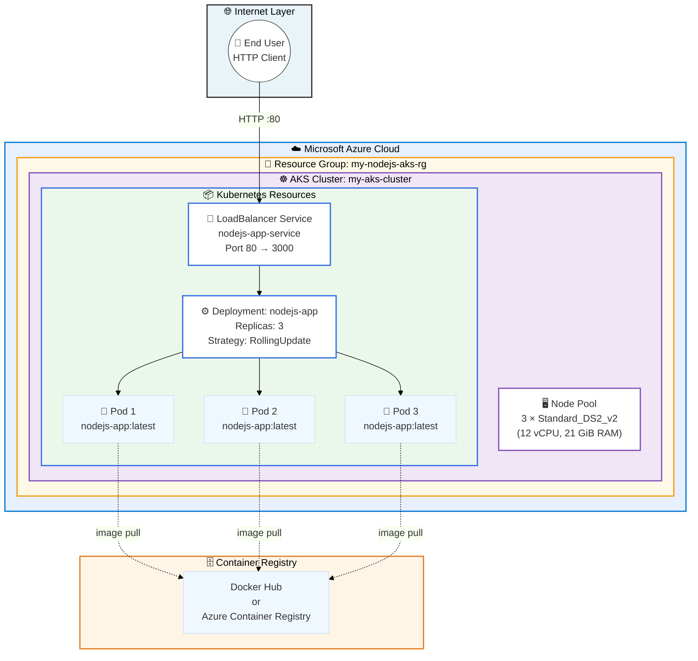

# Node.js on Azure Kubernetes Service (AKS) — Infrastructure as Code

[](https://www.terraform.io/)
[](https://azure.microsoft.com/)
[](https://kubernetes.io/)
[](https://nodejs.org/)
[](https://www.docker.com/)

An end-to-end **Infrastructure as Code** project that provisions an **Azure Kubernetes Service (AKS)** cluster via **Terraform**, containerizes a **Node.js (Express)** web server with **Docker**, and deploys it using **Kubernetes** manifests — all automated through shell scripts. Covers the full cloud-native pipeline: cloud provisioning, containerization, orchestration, and application delivery.

---

## 📋 Table of Contents

- [Technology Stack](#-technology-stack)
- [Architecture](#-architecture)
- [Prerequisites](#-prerequisites)
- [Quick Start](#-quick-start)
- [Detailed Walkthrough](#-detailed-walkthrough)
- [Customization](#-customization)
- [Clean Up](#-clean-up)

---

## 📦 Technology Stack

| Skill Area | Technology | Application |
|---|---|---|
| **Infrastructure as Code** | Terraform (HCL) | Declarative provisioning of AKS cluster + resource group |
| **Cloud Platform** | Microsoft Azure (AKS) | Managed Kubernetes with Azure CNI + Calico network policies |
| **Containerization** | Docker | Multi-stage build of Node.js app into portable image |
| **Container Orchestration** | Kubernetes | 3-replica Deployment + LoadBalancer Service |
| **Backend Runtime** | Node.js 14 / Express.js | REST API on port 4000 with 3 routes |
| **Automation** | Bash | Build, tag, push, and deploy scripts |

### Design Rationale

| Decision | Reasoning |
|---|---|
| Terraform over ARM/Bicep | Cloud-agnostic — same config works for AWS/GCP |
| AKS with Azure CNI | Native Azure networking; Calico for network policies |
| System-assigned identity | No manual secret management for cluster auth |
| 3 replicas | Balance between availability and cost |
| Standard_DS2_v2 nodes | Cost-effective burstable VMs for dev/test |
| Shell scripts over CI config | Pipeline-agnostic — portable to GitHub Actions, GitLab CI, Azure DevOps |

---

## 🛠️ Prerequisites

| Tool | Min Version | Why |
|---|---|---|
| [Azure CLI](https://docs.microsoft.com/cli/azure/install-azure-cli) | Latest | `az login` + `az aks get-credentials` |
| [Terraform](https://www.terraform.io/downloads) | >= 1.0 | `terraform init` / `apply` / `destroy` |
| [Docker](https://docs.docker.com/get-docker/) | Latest | `docker build` / `push` |
| [kubectl](https://kubernetes.io/docs/tasks/tools/) | >= 1.21 | `kubectl apply` / `get service` |

Plus an **active Azure subscription** with quota for 3 x Standard_DS2_v2 VMs (12 vCPUs, 21 GiB RAM total).

---

## 📐 Architecture

### Cloud Infrastructure Layout



### End-to-End Deployment Pipeline

```mermaid
%%{init: {'theme': 'base', 'themeVariables': { 'primaryColor': '#f4f4f4'}}}%%
graph LR
    subgraph Phase1["⛏️  Phase 1: Provision Infrastructure"]
        direction TB
        TF_Init["terraform init<br/>Initialize providers"]:::tf --> TF_Plan["terraform plan<br/>Preview changes"]:::tf
        TF_Plan --> TF_Apply["terraform apply<br/>Create resources"]:::tf
        TF_Apply --> AKS["✅ AKS Cluster<br/>+ Resource Group"]:::tf
    end

    subgraph Phase2["🐳  Phase 2: Build & Ship Container"]
        direction TB
        D_Build["docker build<br/>Node.js 14 + Express"]:::docker --> D_Tag["docker tag<br/>:latest + :commit-sha"]:::docker
        D_Tag --> D_Push["docker push<br/>to registry"]:::docker
    end

    subgraph Phase3["☸️  Phase 3: Deploy to Kubernetes"]
        direction TB
        K_Deploy["kubectl apply<br/>deployment.yaml"]:::k8s --> K_Service["kubectl apply<br/>service.yaml"]:::k8s
        K_Service --> K_Ready["Rollout complete<br/>3/3 pods running"]:::k8s
        K_Ready --> K_IP["🌍 Public IP assigned<br/>kubectl get svc"]:::k8s
    end

    AKS -.->|"kubeconfig<br/>credentials"| K_Deploy
    D_Push -->|"image reference"| K_Deploy

    classDef tf fill:#844FBA,color:#fff,stroke:#6a3d9a,stroke-width:2px
    classDef docker fill:#2496ED,color:#fff,stroke:#1a7ac4,stroke-width:2px
    classDef k8s fill:#326CE5,color:#fff,stroke:#2858b8,stroke-width:2px

    style Phase1 fill:#f5eefb,stroke:#844FBA,stroke-width:2px,color:#333
    style Phase2 fill:#eef6fe,stroke:#2496ED,stroke-width:2px,color:#333
    style Phase3 fill:#eef3fd,stroke:#326CE5,stroke-width:2px,color:#333
```



### Repository Map

```mermaid
%%{init: {'theme': 'base', 'themeVariables': { 'primaryBorderColor': '#333'}}}%%
graph TD
    Root["📁  nodejs-aks-project/"]:::root

    Root --> Src["📁  src/<br/><i>Application source code</i>"]:::folder
    Root --> TF["📁  terraform/<br/><i>Infrastructure as Code</i>"]:::folder
    Root --> K8s["📁  kubernetes/<br/><i>K8s manifests</i>"]:::folder
    Root --> Scripts["📁  scripts/<br/><i>Automation</i>"]:::folder
    Root --> Readme["📄  README.md<br/><i>Documentation</i>"]:::file

    Src --> AppJS["📄  app.js<br/>Express server :4000<br/>3 routes: / /about /users"]:::js
    Src --> Package["📄  package.json<br/>express ^4.17.1"]:::js
    Src --> Dockerfile["📄  Dockerfile<br/>FROM node:14<br/>EXPOSE 4000"]:::docker

    TF --> Main["📄  main.tf<br/>azurerm_resource_group<br/>azurerm_kubernetes_cluster"]:::hcl
    TF --> Vars["📄  variables.tf<br/>7 inputs: cluster_name,<br/>node_count, vm_size..."]:::hcl
    TF --> Outputs["📄  outputs.tf<br/>kube_config (sensitive)<br/>host, cluster_id"]:::hcl
    TF --> TFVars["📄  terraform.tfvars<br/>my-aks-cluster<br/>3 nodes, northeurope"]:::hcl

    K8s --> Deploy["📄  deployment.yaml<br/>apiVersion: apps/v1<br/>3 replicas, rolling update"]:::yaml
    K8s --> Service["📄  service.yaml<br/>Type: LoadBalancer<br/>Port 80 → 3000"]:::yaml

    Scripts --> BuildSH["📄  build.sh<br/>docker build + tag + push"]:::bash
    Scripts --> DeploySH["📄  deploy.sh<br/>kubectl apply<br/>+ rollout status"]:::bash

    classDef root fill:#2c3e50,color:#fff,stroke:#333,stroke-width:2px
    classDef folder fill:#ecf0f1,color:#333,stroke:#95a5a6,stroke-width:1px
    classDef file fill:#fff,color:#333,stroke:#bdc3c7,stroke-width:1px
    classDef js fill:#fff,color:#333,stroke:#339933,stroke-width:2px
    classDef docker fill:#fff,color:#333,stroke:#2496ED,stroke-width:2px
    classDef hcl fill:#fff,color:#333,stroke:#844FBA,stroke-width:2px
    classDef yaml fill:#fff,color:#333,stroke:#326CE5,stroke-width:2px
    classDef bash fill:#fff,color:#333,stroke:#4eaa25,stroke-width:2px
```



---

## 🚀 Quick Start

```bash
# 1. Authenticate with Azure
az login

# 2. Provision the AKS infrastructure
cd terraform
terraform init
terraform apply    # Review plan before confirming
cd ..

# 3. Connect kubectl to the new cluster
az aks get-credentials --resource-group my-nodejs-aks-rg --name my-aks-cluster

# 4. Build & push the Docker image
#    ⚠️ Edit IMAGE_NAME in scripts/build.sh to point to your registry first
./scripts/build.sh

# 5. Deploy to AKS
#    ⚠️ Edit variables in scripts/deploy.sh first
./scripts/deploy.sh

# 6. Get the public LoadBalancer IP
kubectl get service nodejs-app-service
```

---

## 🔧 Detailed Walkthrough

### 1. Terraform (`terraform/`)

Provisions two Azure resources:

- **`azurerm_resource_group`** — Logical container (`my-nodejs-aks-rg` in `northeurope`)
- **`azurerm_kubernetes_cluster`** — Managed Kubernetes with:
  - Default node pool: 3x `Standard_DS2_v2`
  - Azure CNI + Calico network policies
  - System-assigned managed identity
  - Configurable tags for environment tracking

**Sensitive outputs** (not shown in logs): `kube_config`, `host`, `client_certificate`.

### 2. Application (`src/`)

A minimal Express.js server listening on **port 4000**:

| Endpoint | Response |
|---|---|
| `GET /` | `"Hello from Node.js on AKS!"` |
| `GET /about` | `"This is a simple Node.js app running on AKS."` |
| `GET /users` | `"User list would be displayed here."` |

The **Dockerfile** uses `node:14`, installs dependencies via `npm install`, and exposes port 4000.

### 3. Kubernetes (`kubernetes/`)

| Manifest | Type | Key Details |
|---|---|---|
| `deployment.yaml` | `apps/v1` | 3 replicas; image `${ACR_NAME}.azurecr.io/nodejs-app:latest` |
| `service.yaml` | `v1` | Type `LoadBalancer`; port 80 → `targetPort: 3000` |

### 4. Scripts (`scripts/`)

- **`build.sh`** — Builds the image, tags it with the short git commit hash and `latest`, pushes to your registry
- **`deploy.sh`** — Creates a namespace (optional), applies Deployment + Service manifests inline, waits for rollout

---

## ⚙️ Customization

### Terraform Variables (`terraform/terraform.tfvars`)

```hcl
resource_group_name = "my-nodejs-aks-rg"
location            = "northeurope"
cluster_name        = "my-aks-cluster"
node_count          = 3
vm_size             = "Standard_DS2_v2"
```

All 7 variables are defined in `variables.tf` with defaults and descriptions.

### Changing the Application Port

The app listens on **port 4000** (`src/app.js`). If you change it, also update:

1. `kubernetes/deployment.yaml` — `containerPort`
2. `kubernetes/service.yaml` — `targetPort`

### Container Registry

The build script pushes to Docker Hub by default. For **Azure Container Registry**, set `ACR_NAME` in your environment and reference it in both scripts and manifests.

---

## 🧹 Clean Up

```bash
cd terraform
terraform destroy
```

Destroys the resource group, AKS cluster, and all associated networking — no orphaned resources, no ongoing costs.

---

## ✅ Key Capabilities

- **Infrastructure as Code** — Declarative Azure environment in Terraform; repeatable, version-controlled, destroyable
- **Containerization** — Node.js app packaged into a portable Docker image with multi-stage build
- **Kubernetes Orchestration** — Deployments (3 replicas, rolling updates) + LoadBalancer Service for public access
- **CI/CD-Ready Automation** — Scripted build, tag, push, and deploy pipeline; portable to GitHub Actions, GitLab CI, or Azure DevOps
- **Cloud-Native Security** — System-assigned managed identity, sensitive output masking, Calico network policies

---

## 📄 License

[MIT](../LICENSE)
